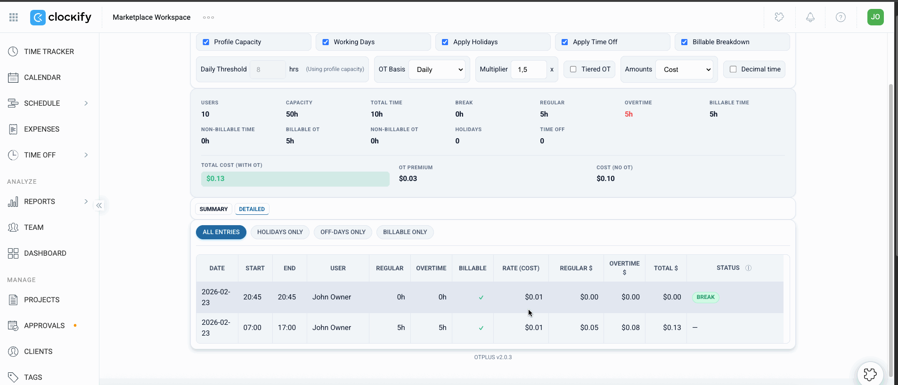

# OTPLUS

Clockify sidebar add-on for overtime tracking. Shows daily/weekly overtime, capacity usage, break hours, billable splits, and amounts per user for a selected date range. Exports to CSV.



## Stack

- TypeScript, esbuild
- Cloudflare Worker + KV (settings, lifecycle)
- GitHub Pages (static hosting)
- Jest, Playwright, ESLint

## Install

1. Clockify → **Settings → Add-ons → Custom Add-ons**
2. Manifest URL: `https://otplus-worker.petkovic-aleksandar037.workers.dev/manifest`
3. **Install**

Needs Clockify Standard+ and workspace admin.

## Self-host

1. Fork, enable GitHub Pages (Actions source)
2. Deploy `worker/` with Wrangler — bind `SETTINGS_KV`, set `GITHUB_PAGES_ORIGIN`
3. Set `baseUrl` in `manifest.json` to your Worker URL, push

CI secrets: `CLOUDFLARE_API_TOKEN` (required), `SENTRY_DSN` (optional).

## Dev

```bash
npm ci && npm run build
npm test
npm run typecheck
npm run lint
npm --prefix worker test
npm run test:e2e
```
